<!-- Generated by GitHub Profile Agent Console. Edit profile.config.json, then run npm run generate. -->

  <picture>
    <source media="(max-width: 760px) and (prefers-color-scheme: dark)" srcset="./assets/hero/agent-console-9f44204e-mobile-dark.svg">
    <source media="(max-width: 760px)" srcset="./assets/hero/agent-console-9f44204e-mobile-light.svg">
    <source media="(prefers-color-scheme: dark)" srcset="./assets/hero/agent-console-9f44204e-dark.svg">
    <source media="(prefers-color-scheme: light)" srcset="./assets/hero/agent-console-9f44204e-light.svg">
    
  </picture>

  
  

## About Me

Mendesain antarmuka (UI/UX) dan mengembangkan web interaktif.

Fokus konversi landing page, sistem desain, dan otomatisasi.

## Current Focus

| Area | What I am exploring |
| --- | --- |
| **Web & UI/UX Design** | Perancangan tata letak, desain, dan pengalaman pengguna. |
| **Frontend Dev** | Pengembangan antarmuka website dan otomatisasi web. |
| **Brand Identity** | Pembuatan identitas visual dan sistem desain konsisten. |

## Featured Work

| Project | Focus | Why it matters |
| --- | --- | --- |
| [**Batur Travel**](https://github.com/akramjunaidi) | GDG Live Indonesia | Desain & pengembangan platform wisata Batur Travel Lombok. |
| [**Inspire Project**](https://github.com/akramjunaidi) | Islamic Relief ID | Inisiatif sosial berkolaborasi dengan Islamic Relief. |
| [**AI Academic Asst**](https://github.com/akramjunaidi) | BRIN | Pengembangan asisten akademik AI untuk riset nasional. |
| [**Aerodinamika**](https://github.com/akramjunaidi) | Science Civilization | Kajian aerodinamika terapan pada penerbangan gliding. |
| [**Gitsight**](https://github.com/akramjunaidi) | AI-Powered Branding | Ekosistem branding developer berbasis teknologi AI. |
| [**KSByte Tourism**](https://github.com/akramjunaidi) | BRIDA West Sumbawa | Platform pariwisata digital untuk BRIDA Sumbawa Barat. |

## Research Direction

Fokus pengembangan desain produk, konversi web, dan rekayasa UI.

## Tech Stack

`Figma` · `UI/UX Design` · `HTML/CSS` · `JavaScript` · `Git`

## Recent Activity

<!-- AUTO:ACTIVITY:START -->
- Sep 12, 2026: pushed 1 commit to [akramjunaidi/akramjunaidi](https://github.com/akramjunaidi/akramjunaidi).
- Sep 12, 2026: created a branch in [akramjunaidi/akramjunaidi](https://github.com/akramjunaidi/akramjunaidi).
<!-- AUTO:ACTIVITY:END -->

---

  Building thoughtful designs and sharing what works.

