<!-- Generated by GitHub Profile Agent Console. Edit profile.config.json, then run npm run generate. -->

  <picture>
    <source media="(max-width: 760px) and (prefers-color-scheme: dark)" srcset="./assets/hero/agent-console-1af8281c-mobile-dark.svg">
    <source media="(max-width: 760px)" srcset="./assets/hero/agent-console-1af8281c-mobile-light.svg">
    <source media="(prefers-color-scheme: dark)" srcset="./assets/hero/agent-console-1af8281c-dark.svg">
    <source media="(prefers-color-scheme: light)" srcset="./assets/hero/agent-console-1af8281c-light.svg">
    
  </picture>

  

## About Me

Fokus pada eksplorasi pemrosesan data, pemodelan algoritma, dan sistem perangkat lunak terstruktur.

Suka memadukan analisis logika dengan pendekatan teknis untuk membangun proyek yang bermanfaat.

## Current Focus

| Area | What I am exploring |
| --- | --- |
| **Python & Data Science** | Pengolahan data, visualisasi, dan pemrosesan algoritma. |
| **Database & AI Systems** | Perancangan basis data dan integrasi logika aplikasi cerdas. |
| **Graphic Design & Branding** | Visual branding, penyusunan tata letak, dan perancangan media digital. |

## Featured Work

| Project | Focus | Why it matters |
| --- | --- | --- |
| [**SQLSense**](https://github.com/USERNAME_GITHUB_KAMU/SQLSense) | AI & Database Integration | Aplikasi integrasi AI dengan manajemen basis data untuk pengelolaan data yang lebih cerdas. |

## Research Direction

Fokus pada pengembangan algoritma optimasi, analisis data, dan integrasi basis data untuk aplikasi praktis.

## Tech Stack

`Python` · `NumPy` · `Matplotlib` · `SQL` · `Git`

## Recent Activity

<!-- AUTO:ACTIVITY:START -->
_Recent public activity will appear here after the workflow runs._
<!-- AUTO:ACTIVITY:END -->

---

  Building thoughtful systems and sharing what works.

